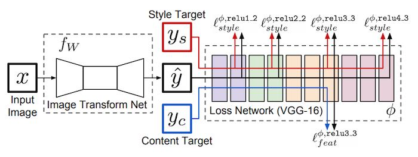
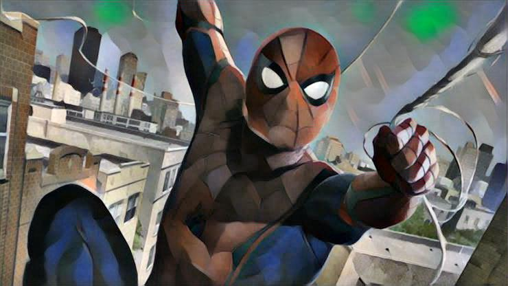

# Tools and technology used during Project.
* `Google's Colab platform for GPU utilization`
* `Pytorch framework`
* `Python `
# Implementation of Fast neural Style transfer with Pytorch
The neural style trasnfer implemented in this project is based on the paper <b>Perceptual Losses for Real-Time Style Transfer and Super-Resolution</b> by Fei-Fei Li. which was an extension of the <b>"A Neural Algorithm of Artistic Style"</b> by Gatys et al., originally released to ArXiv 2015 , but it was limited to images only due to slow processing of images. 

## Archietecture
The proposed model architecture is composed of two components: 
* `1. Image Transformation Network `
* `2. Loss Network `

	 

### Image Transformation Network:

The Image Transformation Network is a deep residual Convolutional Neural Network which is trained to solve the optimization problem proposed by Gatys.Given an input image (x) this network transforms it into the output image (ŷ).

### Loss Network:
The Loss Network(Φ) is a pretrained VGG16 on the ImageNet Dataset.The loss network is used to get content and style representations from the content and style images.

## Training
* Used Google colab for training due to limited resources.
* Network trained on COCO Dataset (for content images).
* 80k training images resized to 256x256 patches.
* Batch size: 4
* With 40k iterations (~2 epochs)
* Optimizer used: Adam
* Learning rate: 1e-3
* Training takes ~4 hours on Tesla K80 GPU

## Results
## Applying style transfer on images

*Content* | *Style* | *Style Transfer* 
:---: | :---: | :---: | 
 |  |  
 |  |  
 |  |  
 |  |  

## Applying style transfer on videos

*Content* | *Style* | *Style Transfer* 
:---: | :---: | :---: | 
 |  |  
 |  |  
 |  |  
 |  |  
