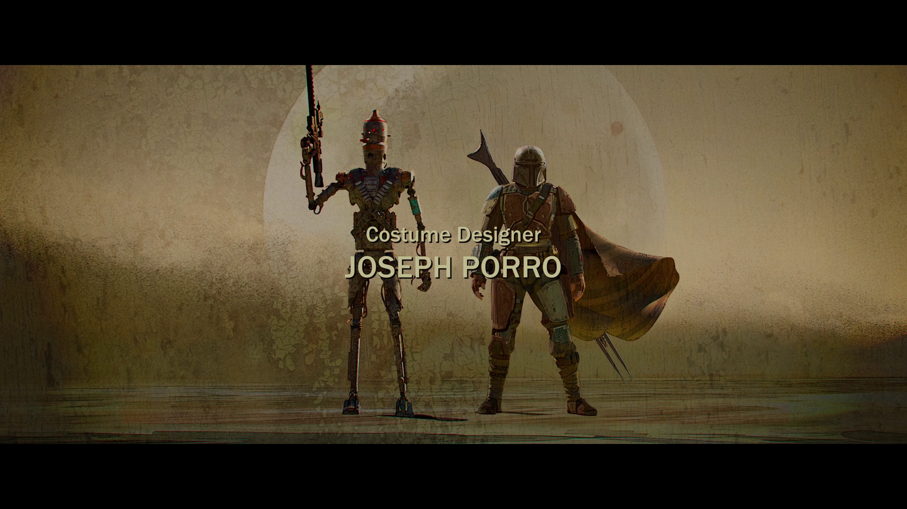
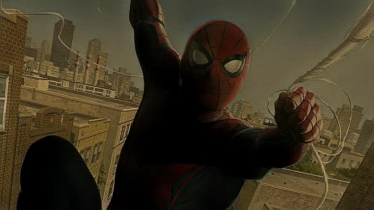
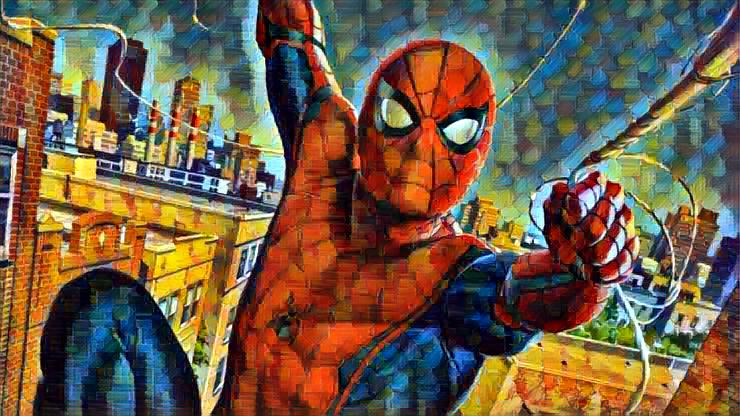
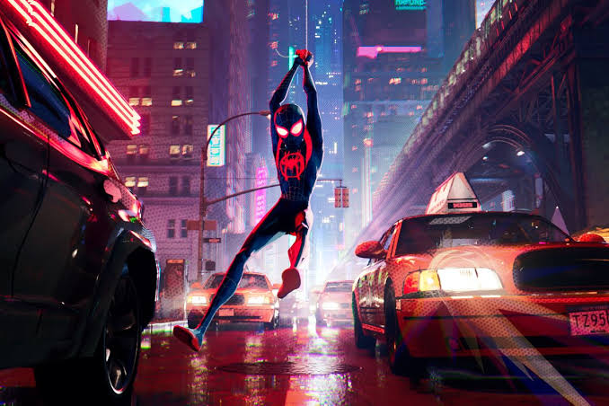
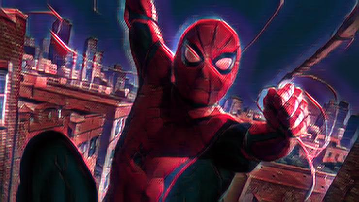
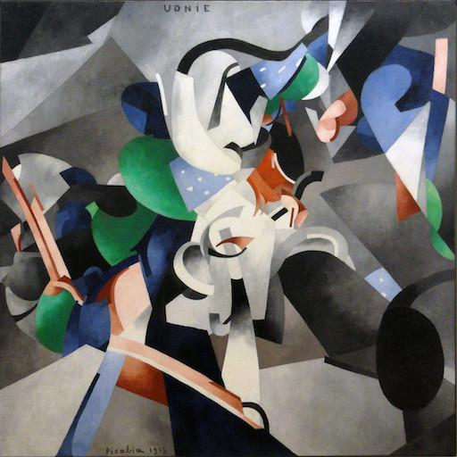

# Fast-Neural-Style-Transfer-Pytorch-Implementation(with perceptual loss)
## Results
## Applying style transfer on images

 

## Applying fast style transfer on videos

*Content* | *Style* | *Style Transfer* 
:---: | :---: | :---: | 
 |  |  

 |  |  

 |  |  

 |  |  
